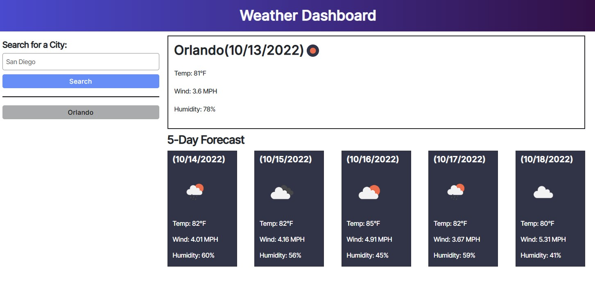
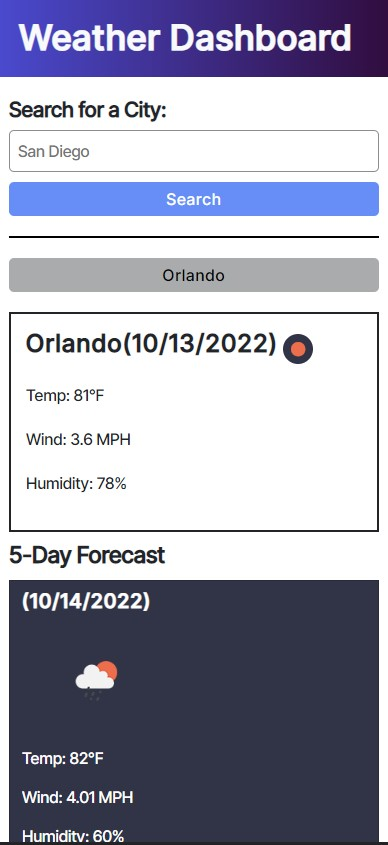

# 06-Module-Challenge

### Server-Side APIs Challenge: Weather Dashboard

---

## Weather Dashboard

[Weather Dashboard](https://josejpd3.github.io/06-Module-Challenge/) is a fast and easy to use application that allows you to quickly access weather data from any given city. Upon entering a city, the current weather along with a 5 day forecast is displayed on the page.   With the capability to store your past searches in order to quickly go back and access.

---

## Begin by entering the name of a city, and pressing search.
### When revisiting the page you are able to quickly click on the history buttons to quickly access those previous cities.

___

## Desktop

___

## Phone

